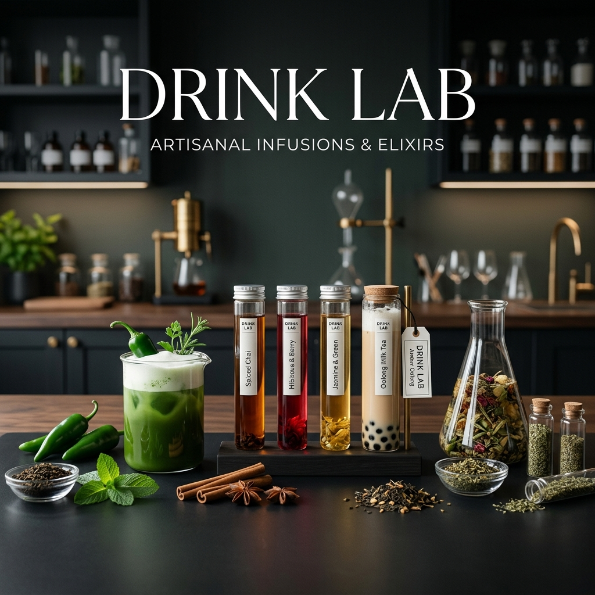

# 🧪 飲料實驗室 (Drink Lab)

> **「風味是古老的煉金術，而我們是拿著吸管的化學家。」**
> 
> 本專案旨在探索高雄鹽埕區（奶茶一條街）及其周邊的各類手搖飲。我們不追求單純的高分，而是專注於探索風味組合中的**「衝突感」**與**「和諧度」**。

---

## 🔬 實驗核心指標

對每一杯新奇飲品，我們將進行五個維度的數據分析：

1.  **風味新奇度 (Novelty)**：組合是否突破傳統？
2.  **元素和諧度 (Harmony)**：配料與茶底是否打架？
3.  **茶感辨識度 (Tea Base)**：茶葉本質是否被掩蓋？
4.  **口感層次 (Texture)**：固態配料的咀嚼體驗。
5.  **回購意願 (Revisit)**：是否有重複實驗的價值。

---

## 📊 實驗報告清單

| 日期 | 店名 | 飲品名稱 | 實驗結果 | 詳細報告 |
| :--- | :--- | :--- | :--- | :--- |
| 2026/04/12 | 得正 | 青花椒金萱 | 🧪 待測 | [查看報告](./reports/2026-04-12-dezheng-pepper.md) |

---

## 🗺️ 鹽埕探索地圖

我們已羅列所有潛在的實驗對象：
- [完整店家名單與攻略等級](./shops.md)
- [實驗報告模板](./report-template.md)

---

## 🏆 年度怪奇飲料排行榜 (2026)

* 🥇 **待定** - (尚未進行首場實驗)
* 🥈 **待定**
* 🥉 **待定**
